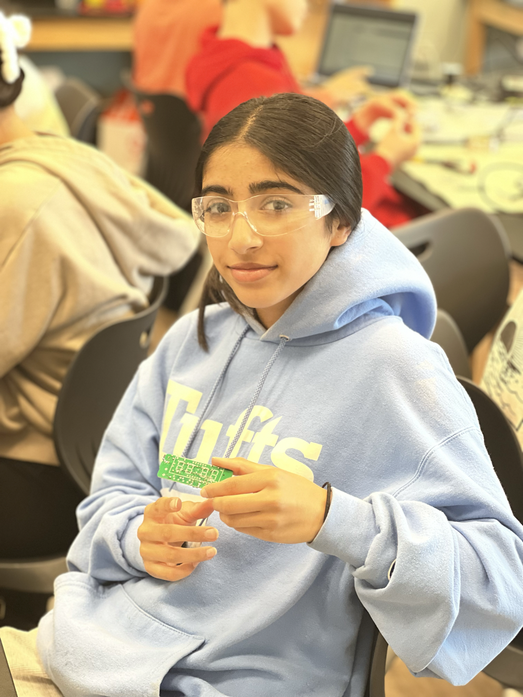

# LED Scrolling Message Board
Replace this text with a brief description (2-3 sentences) of your project. This description should draw the reader in and make them interested in what you've built. You can include what the biggest challenges, takeaways, and triumphs from completing the project were. As you complete your portfolio, remember your audience is less familiar than you are with all that your project entails!

| **Engineer** | **School** | **Area of Interest** | **Grade** |
|:--:|:--:|:--:|:--:|
| Uma A. | San Francisco University High School | Electrical Engineering | Incoming Sophmore

**Replace the BlueStamp logo below with an image of yourself and your completed project. Follow the guide [here](https://tomcam.github.io/least-github-pages/adding-images-github-pages-site.html) if you need help.**

(: height="50%" width="50%")
  
# Final Milestone
For your final milestone, explain the outcome of your project. Key details to include are:
- What you've accomplished since your previous milestone
- What your biggest challenges and triumphs were at BSE
- A summary of key topics you learned about
- What you hope to learn in the future after everything you've learned at BSE

**Don't forget to replace the text below with the embedding for your milestone video. Go to Youtube, click Share -> Embed, and copy and paste the code to replace what's below.**

<iframe width="560" height="315" src="https://www.youtube.com/embed/F7M7imOVGug" title="YouTube video player" frameborder="0" allow="accelerometer; autoplay; clipboard-write; encrypted-media; gyroscope; picture-in-picture; web-share" allowfullscreen></iframe>

# Second Milestone
For your second milestone, explain what you've worked on since your previous milestone. You can highlight:
- Technical details of what you've accomplished and how they contribute to the final goal
- What has been surprising about the project so far
- Previous challenges you faced that you overcame
- What needs to be completed before your final milestone 

**Don't forget to replace the text below with the embedding for your milestone video. Go to Youtube, click Share -> Embed, and copy and paste the code to replace what's below.**

<iframe width="560" height="315" src="https://www.youtube.com/embed/y3VAmNlER5Y" title="YouTube video player" frameborder="0" allow="accelerometer; autoplay; clipboard-write; encrypted-media; gyroscope; picture-in-picture; web-share" allowfullscreen></iframe>

# First Milestone

## The different components of your project 

- WS2812B LED; An LED is a  light-emitting diode is a semiconductor device that emits light when current flows through it. Electrons in the semiconductor recombine with electron holes, releasing energy in the form of photons. The color of the light is determined by the energy required for electrons to cross the band gap of the semiconductor
- BreadBoard; A breadboard, solderless breadboard, or protoboard is a construction base used to build semi-permanent prototypes of electronic circuits. Unlike a perf board or stripboard, breadboards are reusable and do not require soldering or destruction of tracks.
- Arduino Nano; Arduino is an open-source hardware and software company, project, and user community that designs and manufactures single-board microcontrollers and microcontroller kits for building digital devices.

## How they will all integrate together

I attached the end of the LEDs to the power, ground, and control wires. I attached the power wires to the power rail on the breadboard, and the ground wires to the ground rail. Then attached a jumper wire from the power and ground rail to a 5-volt power source. I attached an Arduino Nano to the breadboard and connected jumper wires from the 5-volt pin and the ground pin to their perspective rails. I attached the control wires from the LEDs to the digital pins and installed a code to the Arduino Nano. 

## Progress

Currently, everything is connected to a breadboard and all the LEDs light up but not in words. 

## Challenges 

On the LED strips, there are arrows, and those are in the direction that the electrical current flows. And I didn’t realize this so I was so confused about why my LEDs weren’t lighting up because I put all of the arrows facing towards the Arduino. After I realized this I cut my LEDs from the Arduino because it would be too much to desolder them and do all of that since I already put the wires in the heat tubes. So I moved my project onto a breadboard. 

## What your plan is to complete your project
  
- For my second milestone -  write code for scrolling words and attach it to a perf board


<iframe width="560" height="315" src="https://www.youtube.com/embed/Z8wsoRe9H5c" title="YouTube video player" frameborder="0" allow="accelerometer; autoplay; clipboard-write; encrypted-media; gyroscope; picture-in-picture; web-share" allowfullscreen></iframe>

# Starter Project
For my starter project I decided to make an alarm clock.   

## Project components and their purpose 

- Resistors- regulate the flow of electrical currents in an electrical circuit. They are also used to provide a certain amount of voltage for a transistor. The project required a certain number of Kohms in certain places, meaning it was used to give a certain amount of voltage. 
- Thermistor- In this project, this was used to determine the temperature outside
- Diode- directs the flow of electricity in a single direction, and can maintain a constant voltage and extract signals from video waves. 
- Photoresistor- senses when there is light or there is a light change. The photoresistor in this clock is used to determine the brightness of its surroundings and adjust the brightness of the clock display.
- Crystal oscillators oscillate at a particular frequency, which controls the timing of the circuit.  
- Passive Buzzer- It can play a variety of noises, in the clock it's used as an alarm

## Challenges

I faced many challenges as it was my first project. After I thought I was done with the whole project I realized that it was only showing the default display and I was not able to change the time or use any of the functions. But I troubleshot and I realized that most of the wires in the back were touching. Another problem came up for me, but I noticed the display was not really showing at all, and at first, I thought it was the photoresistor, but the battery just fell out.


<iframe width="560" height="315" src="https://www.youtube.com/embed/gzErr8VK5Jg" title="YouTube video player" frameborder="0" allow="accelerometer; autoplay; clipboard-write; encrypted-media; gyroscope; picture-in-picture; web-share" allowfullscreen></iframe>

# Schematics 
Here's where you'll put images of your schematics. [Tinkercad](https://www.tinkercad.com/blog/official-guide-to-tinkercad-circuits) and [Fritzing](https://fritzing.org/learning/) are both great resoruces to create professional schematic diagrams, though BSE recommends Tinkercad becuase it can be done easily and for free in the browser. 

# Code
Here's where you'll put your code. The syntax below places it into a block of code. Follow the guide [here]([url](https://www.markdownguide.org/extended-syntax/)) to learn how to customize it to your project needs. 

```c++
#include <Adafruit_GFX.h>
#include <Adafruit_NeoMatrix.h>
#include <Adafruit_NeoPixel.h>
#ifndef PSTR
#define PSTR // Make Arduino Due happy
#endif
#define PIN 9

Adafruit_NeoMatrix matrix = Adafruit_NeoMatrix(64, 7, PIN,
  NEO_MATRIX_TOP     + NEO_MATRIX_LEFT +
  NEO_MATRIX_ROWS + NEO_MATRIX_ZIGZAG,
  NEO_GRB            + NEO_KHZ800);

const uint16_t colors[] = {
  matrix.Color(246, 161, 15), matrix.Color(0, 255, 0), matrix.Color(0, 0, 255) };

void setup() {
  matrix.begin();
  matrix.setTextWrap(false);
  matrix.setBrightness(40);
  matrix.setTextColor(colors[0]);
}

int x    = matrix.width();
int pass = 0;

void loop() {
  matrix.fillScreen(0);
  matrix.setCursor(x, 0);
  matrix.print(F("hello world"));
  if(--x < -70) {
    x = matrix.width();
    if(++pass >= 3) pass = 0;
    matrix.setTextColor(colors[pass]);
  }
  matrix.show();
  delay(70);
}

```

# Bill of Materials
Here's where you'll list the parts in your project. To add more rows, just copy and paste the example rows below.
Don't forget to place the link of where to buy each component inside the quotation marks in the corresponding row after href =. Follow the guide [here]([url](https://www.markdownguide.org/extended-syntax/)) to learn how to customize this to your project needs. 

| **Part** | **Note** | **Price** | **Link** |
|:--:|:--:|:--:|:--:|
| Item Name | What the item is used for | $Price | <a href="https://www.amazon.com/Arduino-A000066-ARDUINO-UNO-R3/dp/B008GRTSV6/"> Link </a> |
|:--:|:--:|:--:|:--:|
| Item Name | What the item is used for | $Price | <a href="https://www.amazon.com/Arduino-A000066-ARDUINO-UNO-R3/dp/B008GRTSV6/"> Link </a> |
|:--:|:--:|:--:|:--:|
| Item Name | What the item is used for | $Price | <a href="https://www.amazon.com/Arduino-A000066-ARDUINO-UNO-R3/dp/B008GRTSV6/"> Link </a> |
|:--:|:--:|:--:|:--:|

# Other Resources/Examples
One of the best parts about Github is that you can view how other people set up their own work. Here are some past BSE portfolios that are awesome examples. You can view how they set up their portfolio, and you can view their index.md files to understand how they implemented different portfolio components.
- [Example 1](https://trashytuber.github.io/YimingJiaBlueStamp/)
- [Example 2](https://sviatil0.github.io/Sviatoslav_BSE/)
- [Example 3](https://arneshkumar.github.io/arneshbluestamp/)

To watch the BSE tutorial on how to create a portfolio, click here.


